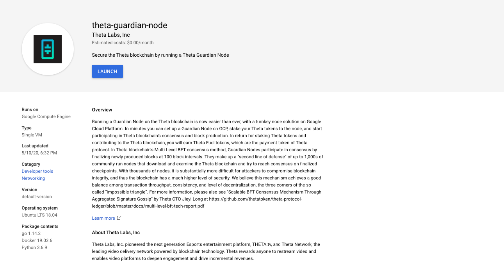
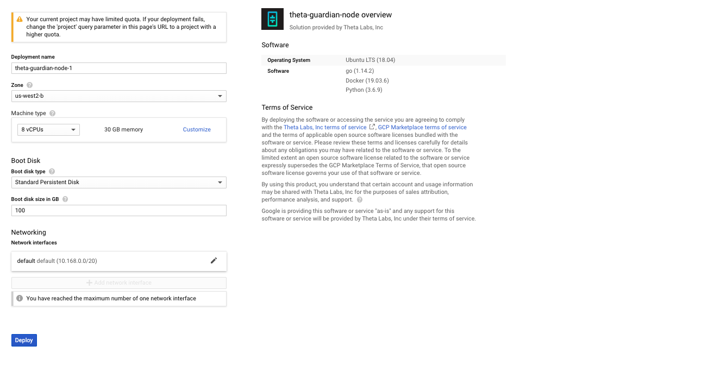
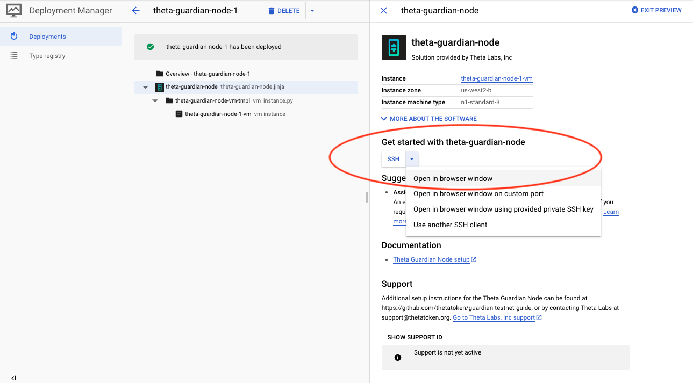
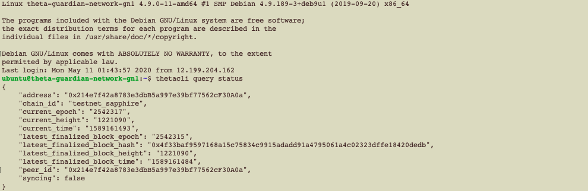
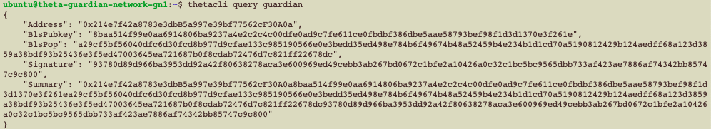

# Running a Guardian Node on the GoogleCloud Marketplace

## Deploying

First off we are going to launch the VM. Simply go to the following page: 
https://console.cloud.google.com/launcher/config/theta-marketplace-public/theta-guardian-node. On the dashboard, click on the "Launch" button



You can take the default settings or customize them.  When complete click "Deploy"



That's it! Your guardian node is now deploying.


## Stake to the Guardian Node

Next, we need to stake your THETA to the node to make it a Guardian node. First let us connect to the VM via ssh as highlighted in the image below



After you have logged onto the machine, first run the following command to check if the node is synchronized with the network.

```
thetacli query status
```

Wait until the return says `"syncing": false` as shown below. It might take 10 to 15 mins for the node to synchronize with the network.



After the node is in-sync with the network, we can query its guardian summary in preparation for the staking. Please run the following command to query the guardian summary.

```
thetacli query guardian
```



Now, copy the `"Summary"` field from the return, and we can proceed to [stake to the guardian node](./STAKING.md).

