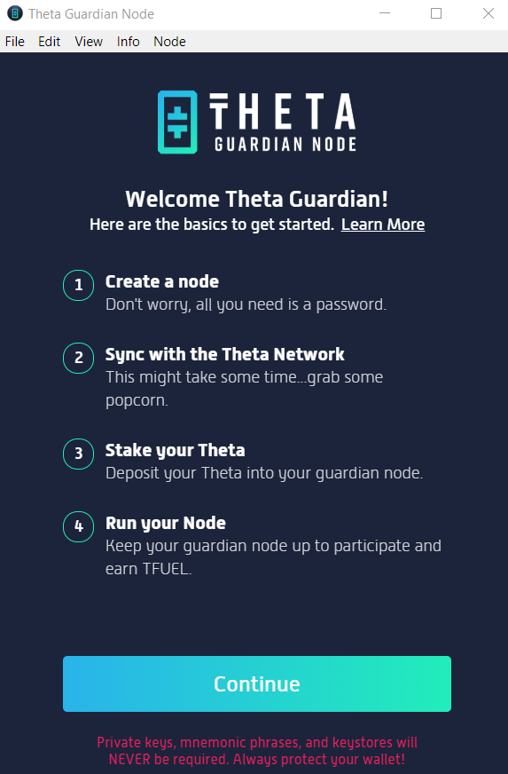
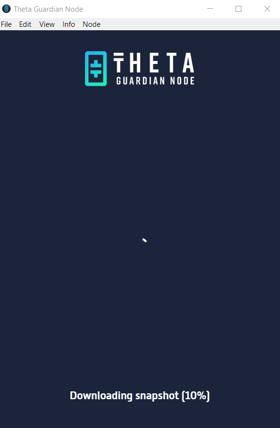
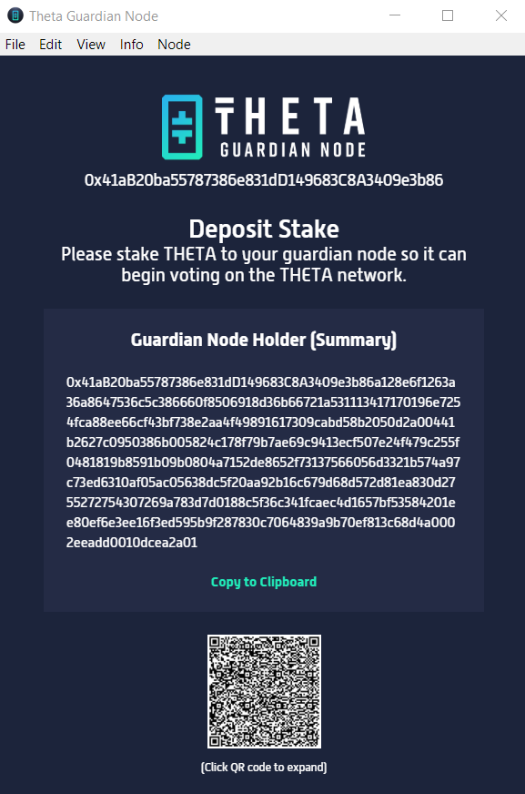
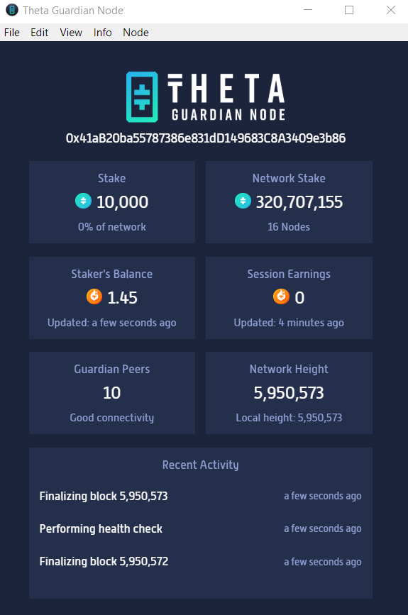

# Running a Guardian Node through Graphical User Interface

## Download the installation file

Please download the latest installation file from here for [Windows](https://api.thetatoken.org/downloads/guardian-node/windows?network=mainnet), [macOS](https://api.thetatoken.org/downloads/guardian-node/macos?network=mainnet) (only supports 10.15.x catalina), or [Ubuntu Linux](https://api.thetatoken.org/downloads/guardian-node/linux?network=mainnet). If you prefer to run your guardian node on Mac or Linux from the command line, please follow the instructions [here](./CLI.md#running-a-guardian-node-through-command-line). 

## Install and launch the Guardian node

When you run the Guardian Node app for the first time you'll see a welcome screen with instructions:

Click "**Continue**", then create your GN password and click "**Create Node**". You may see a Windows message asking you to allow access for the Theta app; click "**Allow access**" to continue. 

Allow your Guardian Node to sync to the Theta blockchain. This first time can take some time as you process all the blocks since the latest snapshot available (typically should be less than 10 minutes). 

Once your node has synced, you'll see the `summary` of your node under **Guardian Node Holder (Summary)**. You'll use this to stake your THETA tokens to your Guardian Node. If you need to stake tokens using the QR code, please **click on the QR code image to enlarge it** first, and then you'll be able to scan it.

## Stake to the Guardian node

Now that you have the `summary` of your node, you can proceed to stake some tokens to it to make it a full guardian node. Please follow the instructions [here](./STAKING.md#staking-through-web-wallet) for the steps to stake from Web Wallet. If you want to stake from your Mobile Wallet, please follow the steps [here](./STAKING.md#staking-through-mobile-wallet).

## Verify the Guardian node

After completing the staking transaction the Guardian Node app will display your current stake, total TFUEL earnings, session TFUEL earnings, and your node connectivity. 

You can verify the staking transaction was completed by entering your wallet address or staking address in the [Mainnet block explorer](https://explorer.thetatoken.org/). You can also verify your earnings in the [Theta Wallet](https://wallet.thetatoken.org/). Remember to select **Mainnet** from the drop down menu.

## Verify the TFUEL earning

The Guardian Node app will display your total TFUEL earnings and session TFUEL earnings, or you can also see all of your TFUEL earnings earned by checking your wallet address in the [Mainnet block explorer](https://explorer.thetatoken.org/). Guardian Node TFUEL earnings are awarded every 100 blocks, or approximately every 10 minutes. The first time you launch your Guardian Node, it may take up to 30 minutes (300 blocks) to see the first TFUEL earnings. 

## Withdrawing your stake from the Guardian node

If at a later time you wish to withdraw your stake tokens from the Guardian node, please follow the instructions [here](./WITHDRAW_STAKE.md).
