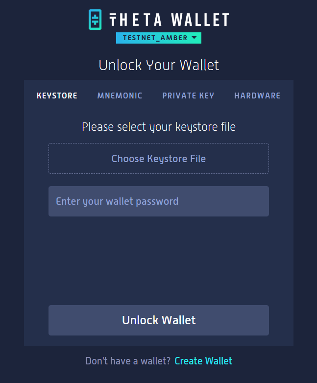
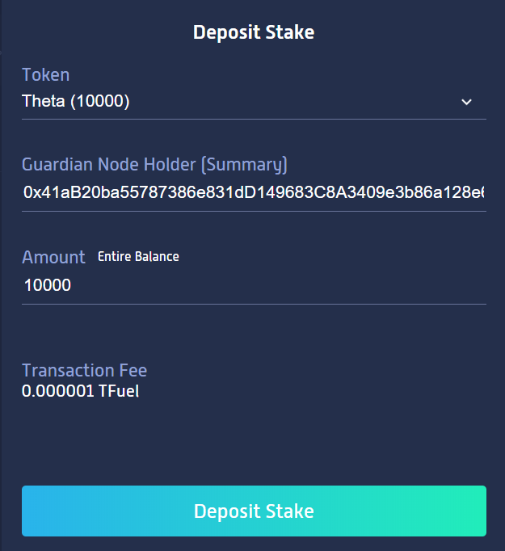
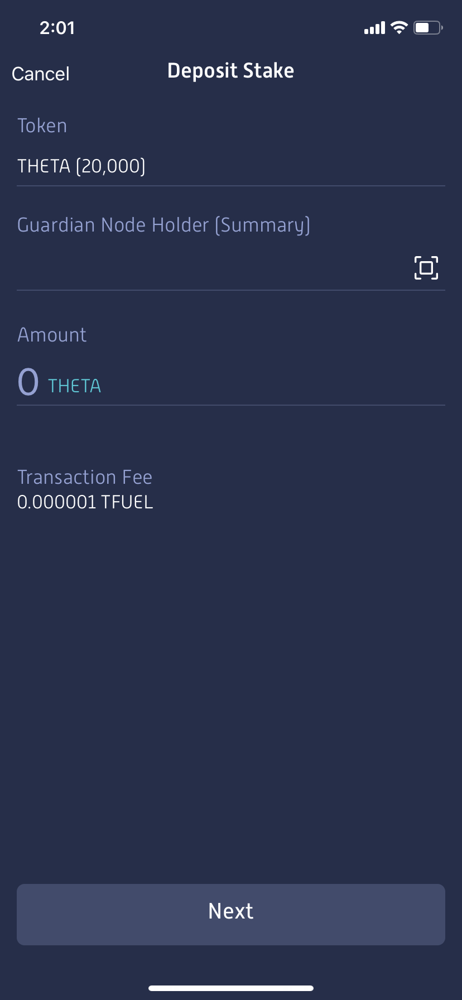
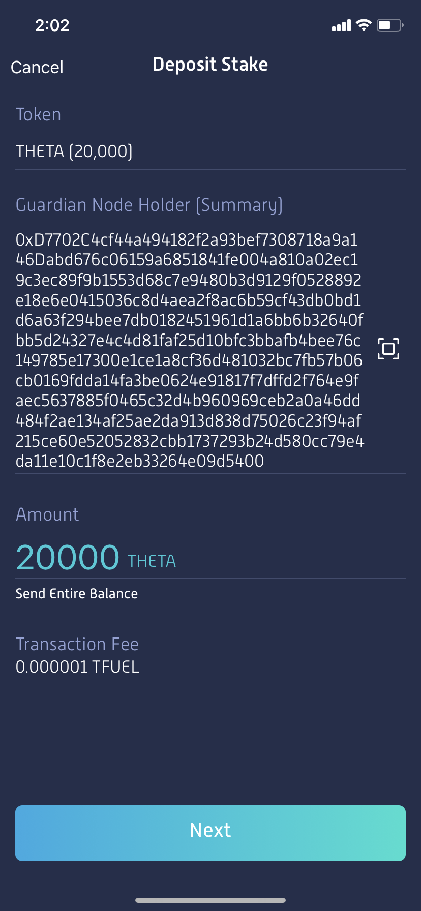

# Guardian Staking Process

## Staking through Web Wallet

Access the [Theta Web Wallet](https://wallet.thetatoken.org) from your desktop/laptop. Under the “Theta Wallet” logo, you can click the **drop down menu** to select a network. Change the selected network to “**Mainnet**: THETA mainnet for Guardian Nodes”, then unlock your Theta wallet using your typical access method (keystore, seed phrase, hardware wallet, etc.). 

Once your wallet is unlocked, click the “**Stakes**” tab of the menu and click “**Deposit Stake**”.

In the **Guardian Node Holder (Summary)** field, enter the text string from your Guardian Node app. Enter the Amount of THETA you want to stake to this node and click “**Deposit Stake**". Note that you need to stake **at least 10,000 THETA**.

After reviewing your stake deposit info on the next screen, enter your wallet password, then click "**Confirm & Deposit Stake**". After the stake deposit transaction is confirmed, you can switch back to the Guardian node to [verify that it is working as expected](./GUI.md#verify-the-guardian-node).

**Important**: If you stake from a Nano Ledger wallet, you'd need to navigate to the Ethereum app, and make sure that in the settings, "Contract data Allowed" and "Debug data NOT Displayed" are selected.

## Staking through Mobile Wallet

Download the Theta Wallet app in the App Store / Play Store, or if already installed make sure  you have upgraded to version 2.0.0 (iOS) / 2.0.0 (Android). Under the “Theta Wallet” logo, you can click the **drop down menu** to select a network. Change the selected network to “**Mainnet**: THETA mainnet for Guardian Nodes”. If the drop down menu is not clickable, please kill and restart the app.

Once your wallet is unlocked, click the “**Stakes**” tab at the bottom of the screen, then click “**Deposit**”.

In the **Guardian Node Holder (Summary)** field of the Theta Wallet app, click the **QR code icon** and use your device to scan the QR code from your Guardian Node app. If you are running the Theta node through the command line, you can also copy/paste the `summary` directly into this field. 

Then in the Wallet app enter the amount of THETA you want to stake to your Guardian Node and click “**Next**". Note that you need to stake **at least 10,000 THETA**.

After the stake deposit transaction is confirmed, you can switch back to the Guardian node to [verify that it is working as expected](./GUI.md#verify-the-guardian-node).
