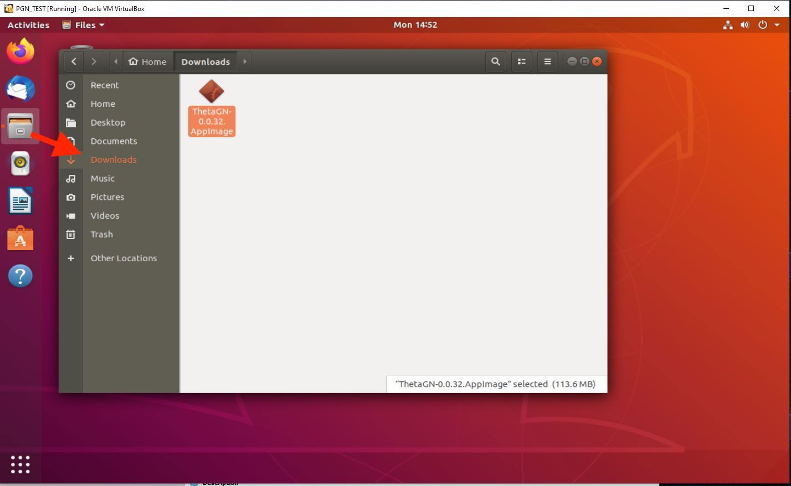
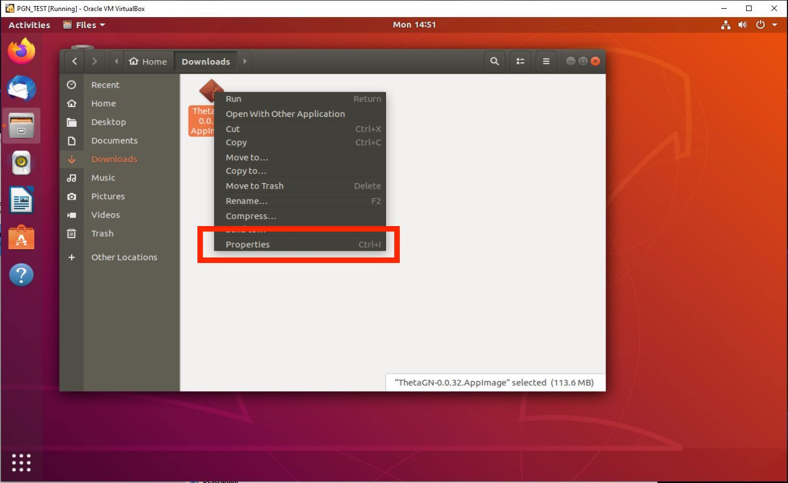
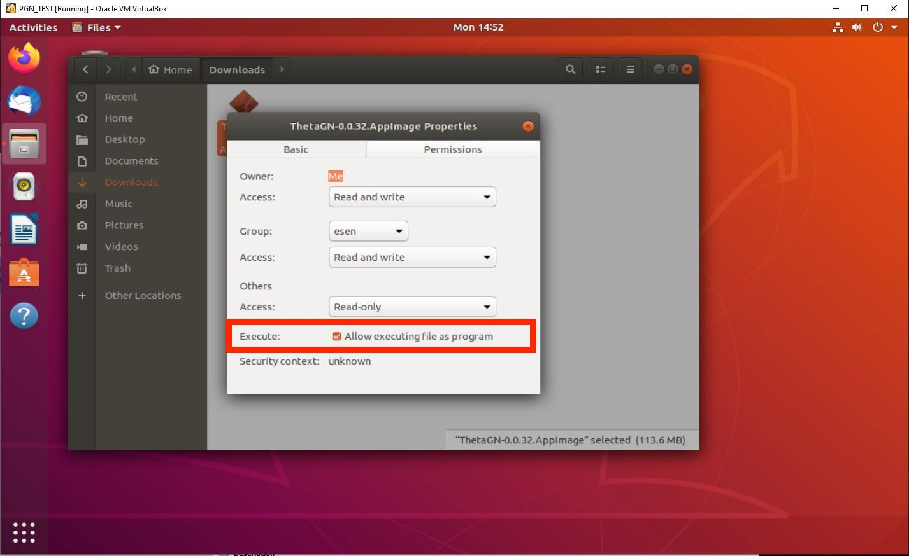
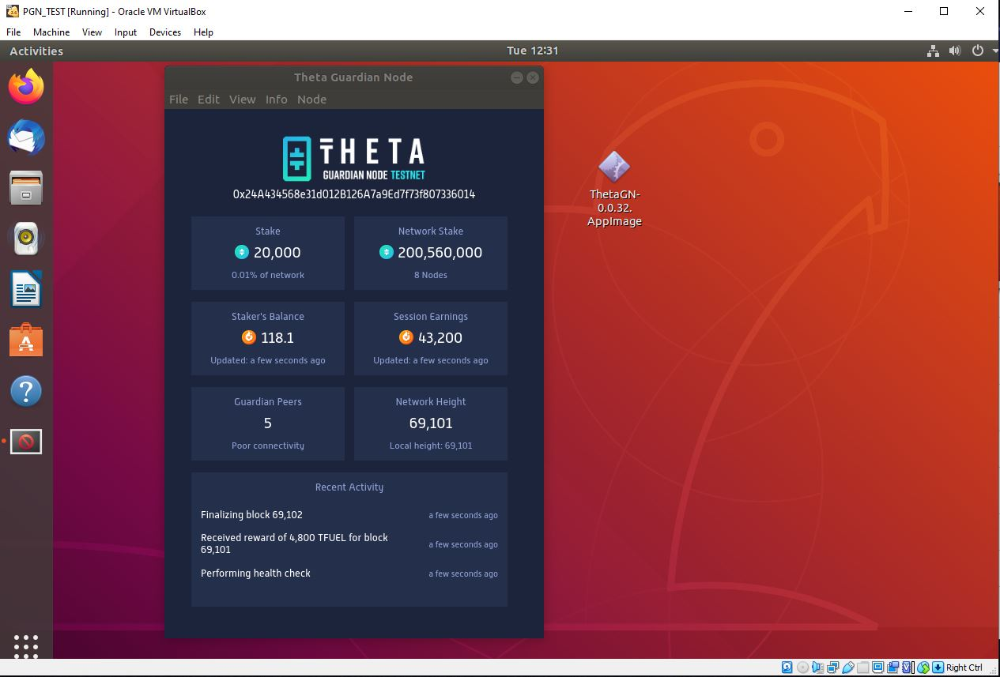
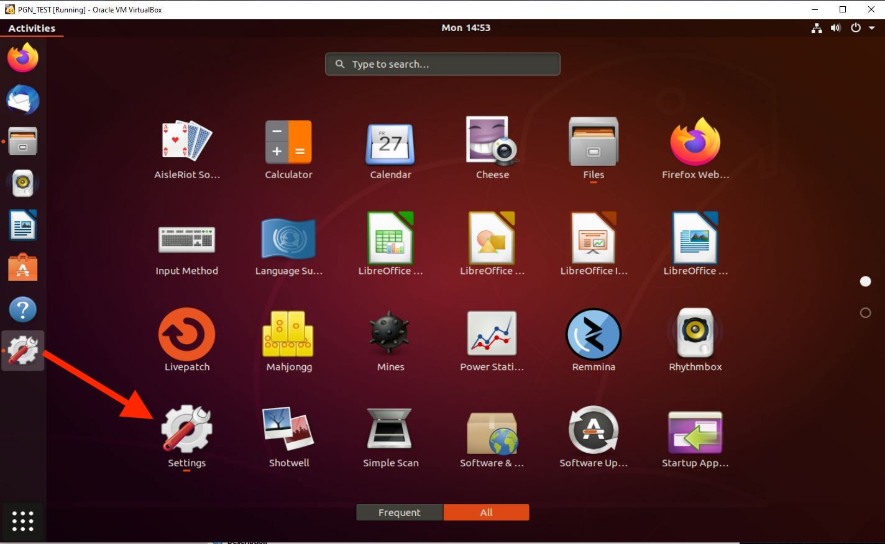
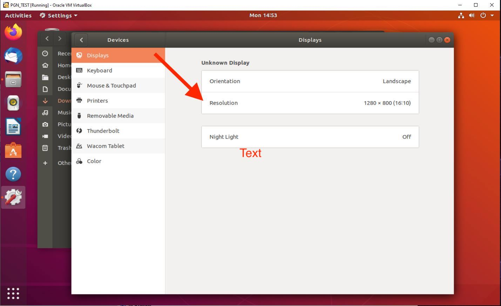
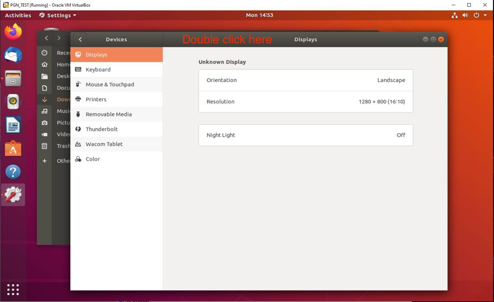

# Running a Guardian Node through VirtualBox on Windows

## Download and install VirtualBox on Windows

Follow the instructions in this video to download and install VirtualBox with Ubuntu Linux 18.04 LTS. Make sure to allocate **AT LEAST** 8GB RAM and 64GB hard drive space.

https://www.youtube.com/watch?v=QbmRXJJKsvs

## Download and launch the Theta Guardian Node

**Step 1**. Open the Firefox browser on the Ubuntu Desktop, and download the Linux Desktop version of the Guardian Node from [here](https://api.thetatoken.org/downloads/guardian-node/linux).

**Step 2**. Navigate to `Files -> Downloads` and find `ThetaGN-x.x.x.Appimage` file

**Step 3**. Right click `Properties -> Permissions`, then checkmark “Allow executing file as 
program”`

**Step 4**. Close the properties window and double click on GN, follow instructions [here](./GUI.md#install-and-launch-the-guardian-node) to launch your Guardian Node. If you need to stake tokens using the QR code, please **click on the QR code image** to enlarge it first, and then you'll be able to scan it.

## Optional: Change screen resolution of your VirtualBox Desktop

**Step 1**. Go to `Applications -> Settings`

**Step 2**. Change resolution. Make sure not to change to your monitor’s native resolution as this might freeze your virtual machine. Apply changes.

If you don’t see the “Apply” button, double click on the Display header and drag window to the left. 

