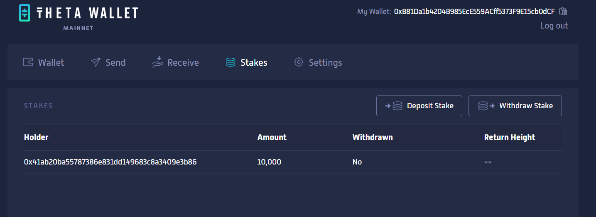
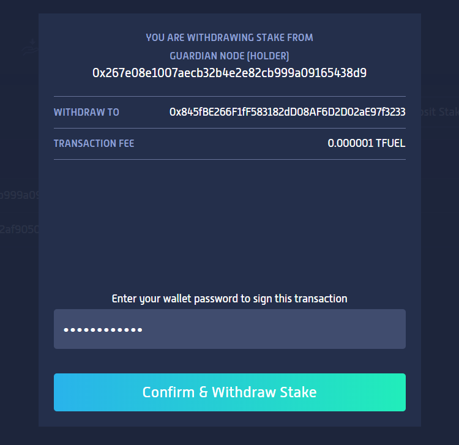

## Withdrawing your stake from the Guardian Node

To withdraw your staked tokens from the Guardian Node using either the Theta Web Wallet or Mobile Wallet, click the "Stakes" tab, then the "Withdraw Stake" button. 

Enter the Guardian Node address you want to the withdraw the stake from and click "Withdraw Stake". On the next screen, review the transaction information, enter your wallet password, and click "Confirm & Withdraw Stake". 

Withdrawn stakes will be returned to your wallet address in approximately 48 hours. In the "Stakes" section of your Theta wallet, you'll now see the stake's Withdrawn status has been changed to "Yes" and there is a projected "Return Height" which is the block at which your stake will be available in your wallet address. 
